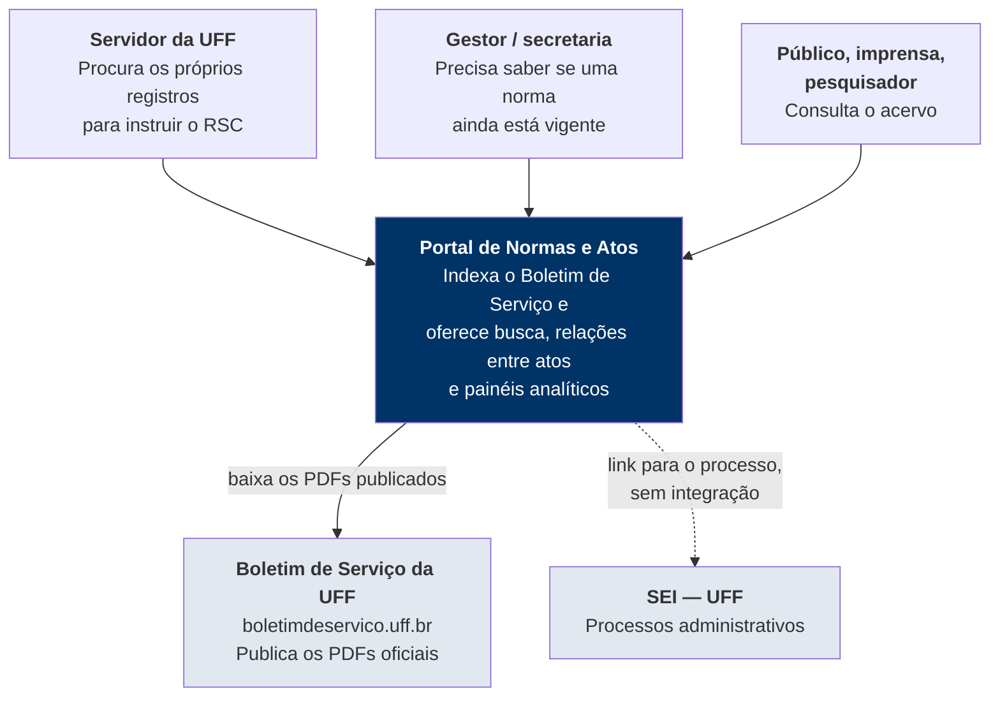
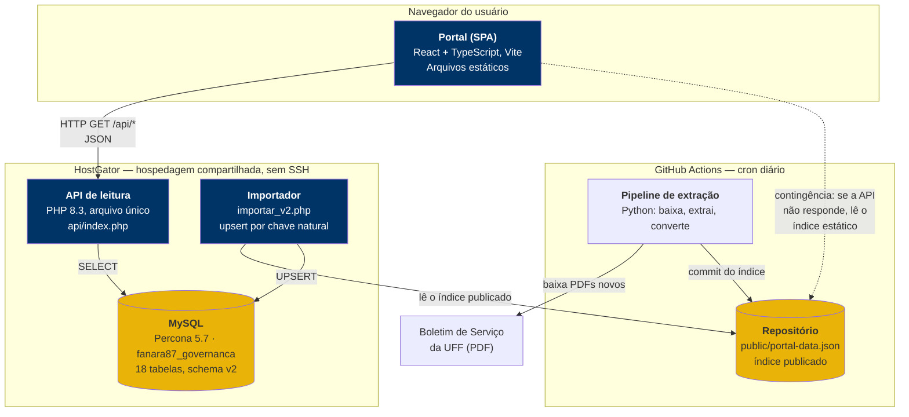
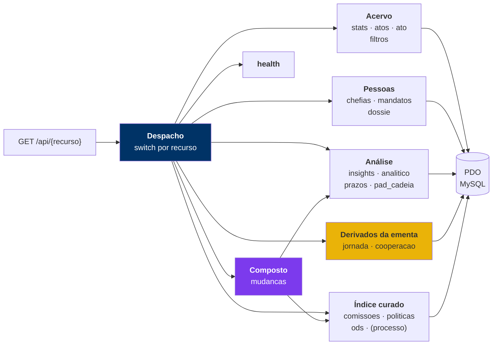
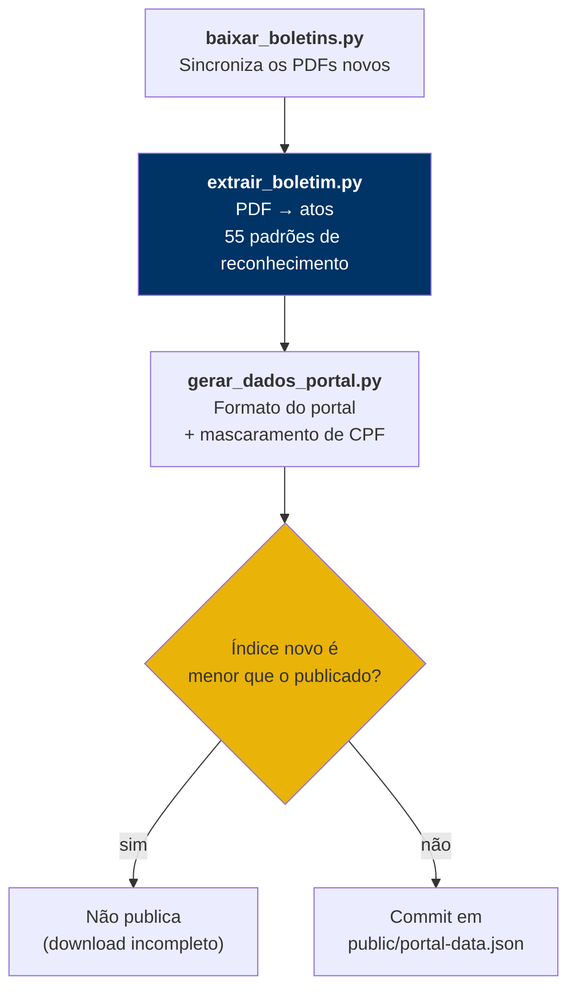
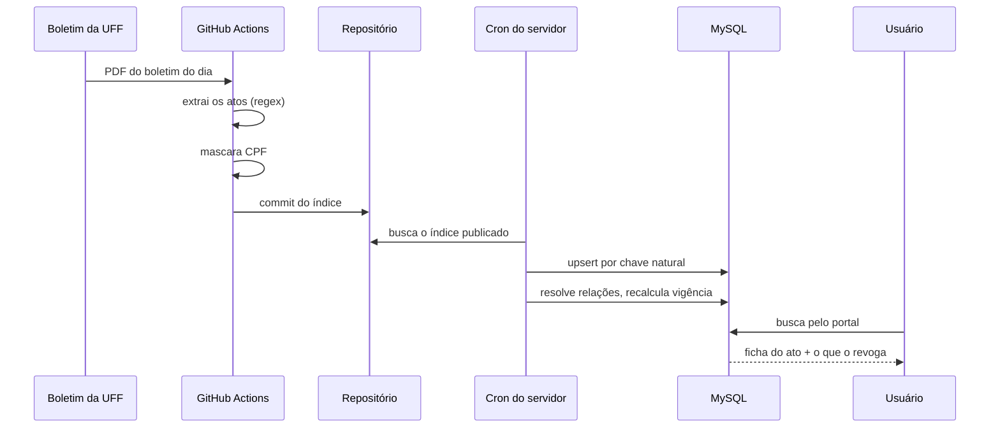

# Arquitetura — modelo C4

Quatro níveis de zoom sobre o mesmo sistema, do mais distante ao mais próximo.
Comece pelo Nível 1; desça só até onde a sua pergunta for respondida.

Este documento descreve a **forma** do sistema. O racional do modelo de dados
(por que estrela, por que `extracao` existe) está em
[`ARQUITETURA-BASE-DADOS.md`](ARQUITETURA-BASE-DADOS.md), e o catálogo dos
padrões de extração em [`REGEX.md`](REGEX.md).

---

## Nível 1 — Contexto

Quem usa e com o que o sistema conversa.

**O portal não é fonte primária.** Ele indexa um acervo que a UFF já publica.
Nenhum ato nasce aqui, e o PDF oficial continua sendo a referência: cada ficha
aponta para o boletim de origem.

**A ligação com o SEI é só um link.** O portal extrai o número do processo do
texto e monta a URL de consulta pública. Não há integração, credencial nem
leitura de dados do SEI.

---

## Nível 2 — Contêineres

As partes que rodam separadamente, e como conversam.

### Por que cada peça é assim

**A API é um arquivo PHP só.** Não há framework, roteador ou gerenciador de
dependências. A hospedagem é compartilhada e sem SSH: não dá para rodar
`composer install` nem manter um processo. Um arquivo que o Apache executa é o
que essa restrição permite, e o `.htaccess` roteia `/api/*` para ele.

**A extração não roda no servidor.** Ler milhares de PDFs consome memória e CPU
que a hospedagem compartilhada não tem. Roda no GitHub Actions, de graça, e o
resultado (um JSON) é o que chega ao servidor.

**O índice trafega pelo Git.** O pipeline commita `public/portal-data.json`, e o
importador no servidor busca esse arquivo pela URL bruta do GitHub. Isso dá
versionamento e reversão de graça: cada atualização da base é um commit.

**A contingência é o mesmo arquivo.** Se a API cair, o front carrega o índice
estático direto e continua servindo busca, com um aviso no topo dizendo que os
painéis que dependem do banco estão indisponíveis. É pior que o modo normal, e
é melhor que uma tela de erro.

**O deploy é manual, por upload.** Sem SSH, `dist/` e `api/index.php` sobem pelo
Gerenciador de Arquivos do cPanel, e todo SQL passa pelo phpMyAdmin.

---

## Nível 3 — Componentes

### Dentro da API

Os grupos existem por **origem do dado**, e a distinção importa:

- **Acervo, Pessoas e Análise** leem tabelas-fato. O trabalho de classificar já
  foi feito na importação; a consulta só junta e conta.
- **Derivados da ementa** (`jornada`, `cooperacao`) não têm tabela própria. São
  calculados na hora, lendo o texto do ato com regex dentro do PHP. É escolha
  deliberada: enquanto a regra de classificação ainda está sendo descoberta,
  mudar um padrão e recarregar custa segundos, contra reprocessar o acervo
  inteiro. Quando a regra estabiliza, vira `INSERT` numa tabela-fato.
- **Índice curado** (`comissoes`, `politicas`, `ods`, a busca por `processo`) lê uma tabela-fato que
  liga o ato a uma entidade por casamento **de frase estrita**, não FULLTEXT — o
  índice de texto tokeniza e daria falso positivo ("segurança da informação"
  casaria "informação" em qualquer lugar). A ligação é cara demais para rodar a
  cada consulta sobre 128 mil textos, então roda uma vez no backfill e a cada
  import; a rota só lê o índice pronto. Para as Comissões, a lista de corpos é
  curada à mão (`comissoes_registro()`), porque "comissão permanente" em texto
  livre é ruído. O mesmo vale para as Políticas: o catálogo sai de
  `tools/gerar_seed_politicas.py`, e cada vínculo carrega o **papel** do ato na
  política — ver [`METODOLOGIA-POLITICAS.md`](METODOLOGIA-POLITICAS.md).
- **Composto** (`mudancas`) é o único grupo que não tem fonte própria: ele
  **soma vínculos que os outros grupos já apuraram** — política, colegiado,
  alteração de vigência, prazo futuro. Cada sinal passou pela conferência da sua
  própria aba; o feed só os junta. Foi decisão de desenho: um classificador novo
  de "relevância" seria uma quarta régua para manter em acordo com as outras
  três, e erraria sozinho. Por isso também **não materializa linha** — a tabela
  `mudanca_relevante` existe no schema e segue vazia.

Uma consequência prática: **análise nova é tabela-fato nova, não coluna nova**
em `ato`. Quem pensa em `ALTER TABLE ato ADD COLUMN` parou no modelo antigo.
O grupo Composto é a exceção que confirma a regra: quando a análise nova é
**combinação** de análises já apuradas, ela não precisa de tabela nenhuma.

### Dentro do pipeline de extração

**A trava anti-regressão não é zelo excessivo.** Se a UFF ficar fora do ar
durante o cron, o download sai incompleto e o índice novo vem menor. Sem a
comparação, esse índice truncado sobrescreveria a base boa e o portal
"perderia" milhares de atos sem ninguém notar até alguém reclamar de uma busca
vazia.

**`extrair_boletim.py` é o arquivo mais sensível do projeto.** Todo o
entendimento que o portal tem do boletim está nos seus padrões. Antes de mexer,
leia [`REGEX.md`](REGEX.md) e [`GUIA-EXTRACAO-BS.md`](GUIA-EXTRACAO-BS.md).

---

## Nível 4 — Código

Não há diagrama aqui de propósito: nível 4 no C4 é o próprio código, e um
desenho dele nasce desatualizado. Os pontos de entrada:

| Quero entender | Abra |
|---|---|
| Como um PDF vira ato | `tools/extrair_boletim.py` |
| O que cada padrão reconhece | [`REGEX.md`](REGEX.md) |
| Como o ato entra no banco | `backend/importar/importar_v2.php` |
| Como as relações são resolvidas | `backend/importar/resolver_relacoes_v2.php` |
| O que cada rota devolve | `backend/api/index_v2.php` |
| Por que o schema é assim | [`ARQUITETURA-BASE-DADOS.md`](ARQUITETURA-BASE-DADOS.md) |
| Armadilhas do corpus | [`GUIA-EXTRACAO-BS.md`](GUIA-EXTRACAO-BS.md) |

---

## O caminho de um ato, de ponta a ponta

O passo que dá ao portal a sua razão de existir é o penúltimo. **Um ato não
anuncia a própria revogação**: ela é publicada anos depois, em outro documento,
que o leitor não tem como saber que existe. Ler o PDF original responde o que
aquele ato diz, nunca se ele ainda vale. É o índice que responde.

---

## Restrições que moldaram o desenho

Vale registrar, porque explicam decisões que fora deste contexto pareceriam
erradas.

| Restrição | Consequência no desenho |
|---|---|
| Hospedagem compartilhada, **sem SSH** | Deploy por upload; SQL por phpMyAdmin; API em arquivo único |
| Sem orçamento de servidor | Extração no GitHub Actions; índice trafega pelo Git |
| O boletim é **PDF sem estrutura** | Todo o entendimento vem de regex, e nenhum é perfeito |
| Formato do boletim mudou várias vezes em 25 anos | Padrões conviventes para a mesma coisa (ex.: três formas de título) |
| Sem equipe | Automação até onde dá; curadoria manual onde regra automática erraria |
